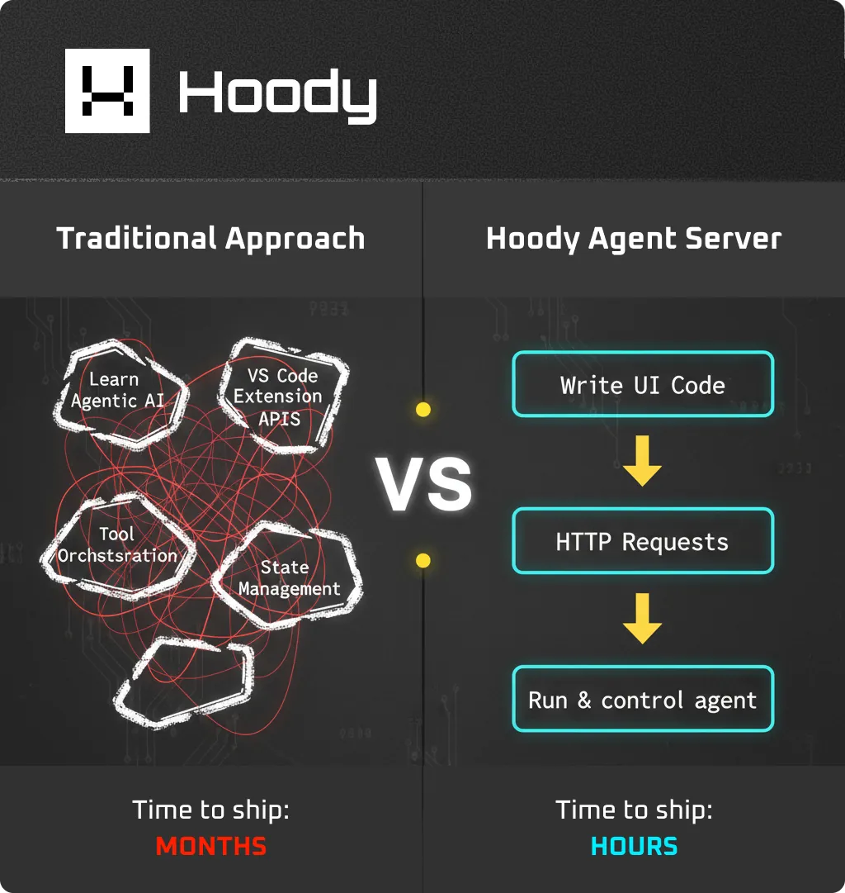

#  Hoody Agent Server

> **Build Your Own AI Coding Assistant in Minutes** - Just Send JSON

A fast, standalone, asynchronous AI agent that provides all the capabilities of Cline, Roocode, and Kilocode via REST API (OpenAPI) and WebSocket. **Compatible with all major model providers** (Anthropic, OpenAI, Google Gemini, OpenRouter, AWS Bedrock, Azure, and 30+ others). Control powerful autonomous coding & task agents by simply sending JSON over HTTP - no complex SDKs or integrations required.

[](https://hoody.com)
[](https://discord.social.hoody.com)
[](https://telegram.social.hoody.com)

---

## 🎁 Great Features

| Feature | Description |
|---------|-------------|
| **⚡ HTTP API** | **Control autonomous AI coding agents by literally just sending JSON** - no SDKs, no complex integrations, no lock-in. Build agent-into-agent workflows (agents calling agents) with pure HTTP. If you can make an HTTP request, you can build AI coding tools |
| **🚀 Async Agent** | **Run unlimited concurrent tasks on each instance** - each lightweight server instance (~250MB RAM) can handle unlimited tasks simultaneously with safe file queuing. Scale horizontally with multiple instances for massive parallel execution. Perfect for 24/7 autonomous operations, batch processing, and production-scale AI workflows |
| **🤖 Universal AI** | Compatible with 30+ model providers: Anthropic, OpenAI, Google Gemini, OpenRouter, AWS Bedrock, Azure, Ollama, LM Studio, and more |
| **🔄 Task Forking** | Fork tasks from any message to explore alternative approaches without losing progress |
| **🔀 Dynamic Mode** | Switch between Code, Architect, Ask, Debug, and Orchestrator modes mid-development based on your needs |
| **🪃 Sub-Agents (Orchestrator)** | Agents can spawn and coordinate sub-agents for complex multi-step tasks, creating hierarchical workflows |
| **💾 Memory Bank** | Persistent AI knowledge storage - the agent remembers patterns, solutions, and best practices across sessions |
| **🔄 Context Condensing** | Automatic context window management - intelligently compresses conversation history when approaching token limits - allowing 24/7 operations |
| **🎨 Image Generation** | Built-in AI image generation and editing capabilities through OpenRouter integration |
| **⚡ Slash Commands** | Extensible command system - create custom prompts and workflows as reusable slash commands |
| **🌐 Browser Automation** | Built-in Puppeteer for web testing, scraping, and interaction |
| **💻 Terminal Control** | Execute commands and monitor output programmatically with full shell integration |
| **📁 File Operations** | Complete filesystem access: read, write, diff, search & replace, insert content |
| **🔒 Concurrent Editing** | Automatic file locking system - you can write code alongside the agent without conflicts. Lock files are transparent and don't clutter your codebase |
| **✅ TODO Management** | Built-in task tracking with automatic status updates and Markdown import/export |
| **💾 Server-Side Storage** | All conversation history, task state, profiles, and agent memory stored server-side - **clients stay completely stateless**. No databases or storage management needed on your end |

---

## 🎯 What Makes This Different?

**The Problem:** Building AI coding assistants like Cline, Roo Code, or Claude Code requires deep knowledge of:
- Agentic AI architectures
- VS Code extension APIs
- Complex tool orchestration
- State management across AI interactions

**The Solution:** Hoody Agent Server bundles a **complete VS Code extension environment** that runs headlessly in Node.js, exposing everything through HTTP/WebSocket APIs. **Control powerful AI agents by simply sending JSON** - no SDKs, no complex integrations. You focus on building great UIs and workflows - Hoody Agent Server handle the complexity: you do not need to run VSCode to interact with it, you either need to build an UI for it, or use it programmatically.

<p align="center">
  
</p>

<p align="center">
  
</p>


---

## 💡 Use Cases: Why Build on This?

- 🎨 **Fast-Iterating AI Coding UIs** - Build custom interfaces with hot reload; ship features 10x faster than VS Code extension development
- 📄 **Single HTML Embeddable Widgets** - Create standalone AI coding assistants in a single `.html` file that can be embedded as iframes anywhere (dashboards, documentation sites, admin panels)
- 📱 **AI Coding on Mobile** - HTTP APIs work on iOS/Android; build native mobile apps for coding on tablets and phones
- 🎯 **Custom Branded AI Tools** - Ship AI coding tools under your brand with total UI/UX control
- 🖥️ **IDE-Agnostic Integration** - Integrate AI coding into JetBrains, Vim, Emacs, Sublime - anything that can make HTTP requests
- 🔧 **CI/CD AI Reviewers** - Embed autonomous AI code review directly in GitHub Actions, GitLab CI, Jenkins
- 🐛 **Automatic Issue Solvers** - Build GitHub/GitLab bots that automatically fix issues - literally just an HTTP call away
- 🎙️ **Voice & Chat Interfaces** - Build voice-controlled coding or ChatGPT-style coding interfaces via WebSocket
- 🏭 **Production Agent Swarms** - Deploy pools of concurrent agents for 24/7 batch processing, monitoring, and autonomous code maintenance at scale

---

## 🚀 Quick Start

### Prerequisites

- **Node.js 22+** (recommended)
- **pnpm** (package manager)
- Git

### 1. Clone & Build

```bash
# Clone the repository
git clone https://github.com/HoodyNetwork/hoody-agent-server.git
cd hoody-agent-server

# Install dependencies
pnpm install

# Build everything (extension + CLI server in one command)
pnpm build:server
```


### 2. Start the Server

```bash
# Start on default port (3000)
npm run start
```

**With Custom Options:**
```bash
npm run start -- --port 3000 --debug
```

**Quick Start with AI Provider:**
```bash
# Anthropic
npm run start -- --provider anthropic --model claude-sonnet-4-20250514 --api-key sk-ant-xxx

# OpenRouter
npm run start -- --provider openrouter --model anthropic/claude-sonnet-4 --api-key sk-or-v1-xxx

# Ollama (local, no API key needed)
npm run start -- --provider ollama --model llama3.2 --provider-base-url http://localhost:11434
```

**Production Setup with SSL:**
```bash
npm run start -- \
  --port 443 \
  --host 0.0.0.0 \
  --ssl-cert /path/to/fullchain.pem \
  --ssl-key /path/to/privkey.pem \
  --ssl-domain your-domain.com \
  --token your-secure-token \
  --workspace /path/to/project \
  --storage-dir /custom/storage \
  --process-title "my-ai-server" \
  --provider anthropic \
  --model claude-sonnet-4-20250514 \
  --api-key sk-ant-xxx
```

**All Available CLI Options:**

| Flag | Description | Default |
|------|-------------|---------|
| `-p, --port <port>` | Server port number | `3000` |
| `-H, --host <host>` | Host address to bind to | `0.0.0.0` |
| `-w, --workspace <path>` | Workspace directory path (must exist) | Current directory |
| `-t, --token <token>` | Authentication token | Auto-generated |
| `-s, --storage-dir <path>` | Custom storage directory (auto-created if needed) | OS-specific* |
| `--process-title <title>` | Process title for identification (ps/htop) | `hoody-ai` |
| `--ssl-cert <path>` | Path to SSL certificate (PEM format) | None (HTTP) |
| `--ssl-key <path>` | Path to SSL private key (PEM format) | None (HTTP) |
| `--ssl-ca <path>` | Path to SSL CA certificate (optional) | None |
| `--ssl-domain <domain>` | Domain name to enforce when using SSL | None |
| `-d, --debug` | Enable debug logging | `false` |
| `--provider <name>` | AI provider (anthropic, openrouter, ollama, etc.) | None |
| `--model <model-id>` | Model identifier (auto-mapped to provider-specific field) | None |
| `--api-key <key>` | API key (auto-mapped to provider-specific field) | None |
| `--provider-base-url <url>` | Custom base URL for the provider | None |

**Default Storage Locations:***
- **Windows:** `%LOCALAPPDATA%\hoodycode` (e.g., `C:\Users\YourName\AppData\Local\hoodycode`)
- **macOS:** `~/Library/Application Support/hoodycode`
- **Linux:** `~/.local/share/hoodycode` (follows [XDG Base Directory spec](https://specifications.freedesktop.org/basedir-spec/basedir-spec-latest.html))

> **💡 Learning Tip:** Add `--debug` flag to see detailed logs of what's being received and returned by the agent server - great for understanding the system quickly!

### 3. Configure Your AI Model

**Option 1: Via CLI Parameters (Recommended for Quick Start)**

Pass provider configuration directly when starting the server:

```bash
# Anthropic
npm run start -- --provider anthropic --model claude-sonnet-4-20250514 --api-key sk-ant-xxx

# OpenRouter
npm run start -- --provider openrouter --model anthropic/claude-sonnet-4 --api-key sk-or-v1-xxx

# Ollama (local)
npm run start -- --provider ollama --model llama3.2
```

**Option 2: Via REST API**

Create an AI profile via the REST API:

```bash
curl -X POST http://localhost:3000/api/v1/agent/profiles \
  -H "Content-Type: application/json" \
  -H "Authorization: Bearer YOUR_TOKEN" \
  -d '{
    "name": "default",
    "apiProvider": "openrouter",
    "openRouterApiKey": "sk-or-v1-your-api-key-here",
    "openRouterModelId": "anthropic/claude-sonnet-4"
  }'
```

**Supported AI Providers & Settings:**

<details>
<summary><b>Anthropic (Claude)</b></summary>

```json
{
  "apiProvider": "anthropic",
  "apiModelId": "claude-sonnet-4-20250514",
  "apiKey": "sk-ant-..."
}
```
</details>

<details>
<summary><b>OpenRouter (30+ models)</b></summary>

```json
{
  "apiProvider": "openrouter",
  "openRouterApiKey": "sk-or-v1-...",
  "openRouterModelId": "anthropic/claude-sonnet-4"
}
```
</details>

<details>
<summary><b>OpenAI (GPT-4, etc.)</b></summary>

```json
{
  "apiProvider": "openai",
  "openAiApiKey": "sk-...",
  "openAiModelId": "gpt-4-turbo"
}
```
</details>

<details>
<summary><b>Google Gemini</b></summary>

```json
{
  "apiProvider": "gemini",
  "geminiApiKey": "AIza...",
  "apiModelId": "gemini-2.0-flash-exp"
}
```
</details>

<details>
<summary><b>AWS Bedrock</b></summary>

```json
{
  "apiProvider": "bedrock",
  "awsAccessKey": "AKIA...",
  "awsSecretKey": "...",
  "awsRegion": "us-east-1",
  "apiModelId": "anthropic.claude-3-5-sonnet-20241022-v2:0"
}
```
</details>

<details>
<summary><b>Azure OpenAI</b></summary>

```json
{
  "apiProvider": "azure",
  "azureApiVersion": "2024-10-21",
  "azureApiKey": "...",
  "azureApiInstancePath": "https://your-instance.openai.azure.com"
}
```
</details>

<details>
<summary><b>Ollama (Local)</b></summary>

```json
{
  "apiProvider": "ollama",
  "ollamaModelId": "qwen2.5-coder:32b",
  "ollamaBaseUrl": "http://localhost:11434"
}
```
</details>

<details>
<summary><b>LM Studio (Local)</b></summary>

```json
{
  "apiProvider": "lmstudio",
  "lmStudioModelId": "your-model-name",
  "lmStudioBaseUrl": "http://localhost:1234"
}
```
</details>

See [docs/api-reference.html](docs/api-reference.html) for all 30+ supported providers.

### 4. Make Your First Request

```bash
# Check server health
curl http://localhost:3000/api/v1/agent/health

# Create an AI coding task
curl -X POST http://localhost:3000/api/v1/agent/tasks \
  -H "Content-Type: application/json" \
  -H "Authorization: Bearer YOUR_TOKEN" \
  -d '{"text": "Create a React component for a todo list"}'
```

**That's it!** You now have autonomous coding agents accessible via HTTP APIs (~250MB RAM, low CPU).

### 🚀 Massive Parallel Execution

Unlike traditional AI tools that handle one task at a time, Hoody Agent Server runs **unlimited concurrent tasks per instance** (~250MB RAM each). Scale horizontally with multiple instances for production-grade AI workflows.

```bash
# Single instance, unlimited concurrent tasks
npm run start -- --port 3000

curl -X POST http://localhost:3000/api/v1/agent/tasks -d '{"text": "Build feature X"}'
curl -X POST http://localhost:3000/api/v1/agent/tasks -d '{"text": "Fix bug Y"}'
curl -X POST http://localhost:3000/api/v1/agent/tasks -d '{"text": "Write tests"}'
# All run simultaneously with intelligent file queuing - no conflicts
```

**Scale to hundreds of instances:**
```bash
npm run start -- --port 3001 &  # Instance 1
npm run start -- --port 3002 &  # Instance 2
npm run start -- --port 3003 &  # Instance 3
```

**Safe concurrent editing** - you and multiple AI agents can edit the same codebase simultaneously. Automatic file queue prevents conflicts without cluttering your repo with lock files.

---

## 🌟 Why Developers Will Love It

### 🎁 **Zero VS Code Required**

Runs headlessly in Node.js with full VS Code extension capabilities - file operations, terminal control, browser automation, MCP integration. No GUI, no bloat.

```bash
npm run start  # No VS Code process needed
```

### 🌐 **Just JSON Over HTTP**

Control autonomous AI agents by sending JSON. No SDKs, no frameworks, no lock-in.

```typescript
// Create a task
await fetch('http://localhost:3000/api/v1/agent/tasks', {
  method: 'POST',
  headers: { 'Content-Type': 'application/json' },
  body: JSON.stringify({ text: 'Build a login form' })
});

// Real-time WebSocket updates
const ws = new WebSocket('ws://localhost:3000/ws?token=YOUR_TOKEN');
ws.onmessage = (e) => console.log('Agent:', JSON.parse(e.data));
```

Works with any platform: web, mobile, desktop, CLI, IoT, CI/CD.

> **💾 Server-Side State Management:** The Hoody Agent Server maintains **ALL** conversation history, task state, profiles, Memory Bank, and agent context. Your client stays **completely stateless** - just send requests and receive updates. No databases, no IndexedDB, no localStorage needed. The server handles everything.

> **📘 WebSocket Reference:** See [docs/WEBSOCKET_MESSAGES.md](docs/WEBSOCKET_MESSAGES.md) for complete message types, examples, and best practices.

### 📦 **OpenAPI 3.0 Compliant - 69 Endpoints**

Complete API coverage for every feature with full OpenAPI specification. Sample endpoints:

**Task Management:**
```bash
POST   /api/v1/agent/tasks                   # Create new task
GET    /api/v1/agent/tasks                   # List all tasks
GET    /api/v1/agent/tasks/{taskId}          # Get task details
DELETE /api/v1/agent/tasks/{taskId}          # Delete task
POST   /api/v1/agent/tasks/{taskId}/resume   # Resume paused task
POST   /api/v1/agent/tasks/{taskId}/respond  # Send user response
```

**AI Profiles:**
```bash
GET    /api/v1/agent/profiles                # List all AI profiles
POST   /api/v1/agent/profiles                # Create profile
POST   /api/v1/agent/profiles/{id}/activate  # Activate profile
PUT    /api/v1/agent/profiles/modes/{mode}   # Assign profile to mode
```

**Memory Bank (Persistent AI Knowledge):**
```bash
GET    /api/v1/agent/memory-bank              # List memories
POST   /api/v1/agent/memory-bank              # Create memory
POST   /api/v1/agent/memory-bank/search       # Search knowledge base
POST   /api/v1/agent/memory-bank/suggest      # Get AI suggestions
```

**Plus 50+ more endpoints** for modes, browser automation, slash commands, and more.

**Full Documentation:**
- **[docs/api-reference.html](docs/api-reference.html)** - Interactive API documentation (open in browser)
- **[README_API.md](README_API.md)** - Complete REST API reference
- **[OPENAPI.yaml](OPENAPI.yaml)** - OpenAPI 3.0 specification (machine-readable)

### 🎨 **Multiple Operating Modes**

The agent adapts to different development scenarios:

| Mode | Purpose | Best For |
|------|---------|----------|
| 💻 **Code** | Write, modify, refactor code | Feature development, bug fixes |
| 🏗️ **Architect** | Plan and design before coding | System design, architecture decisions |
| ❓ **Ask** | Answer questions, explain code | Documentation, learning, research |
| 🪲 **Debug** | Troubleshoot and fix issues | Finding bugs, analyzing errors |
| 🪃 **Orchestrator** | Coordinate complex multi-step tasks | Large projects spanning multiple domains |

---

## 🔥 Code Examples

### Build Complete AI Agents in a Single .html File

**Yes, really!** Build a fully functional AI coding assistant in one `.html` file. No frameworks, no build tools - just open in a browser:

```html
<!DOCTYPE html>
<html>
<head>
  <title>AI Coding Assistant</title>
  <style>
    body { font-family: Arial; max-width: 800px; margin: 50px auto; padding: 20px; }
    input, select { width: 100%; padding: 8px; margin: 5px 0; }
    button { padding: 10px 20px; background: #007bff; color: white; border: none; cursor: pointer; }
    button:disabled { background: #ccc; cursor: not-allowed; }
    #status { margin-top: 20px; padding: 10px; background: #f5f5f5; max-height: 400px; overflow-y: auto; }
  </style>
</head>
<body>
  <h1>🤖 AI Agent Control Panel</h1>
  
  <!-- Step 1: Configure AI Model -->
  <h3>1. Configure AI Model</h3>
  <input id="apiKey" type="password" placeholder="OpenRouter API Key (sk-or-v1-...)">
  <select id="model">
    <option value="anthropic/claude-sonnet-4">Claude Sonnet 4 (Recommended)</option>
    <option value="openai/gpt-4-turbo">GPT-4 Turbo</option>
    <option value="google/gemini-2.0-flash-exp">Gemini Flash</option>
  </select>
  <button onclick="setupProfile()">Setup Profile</button>
  
  <!-- Step 2: Create Task -->
  <h3>2. Create AI Coding Task</h3>
  <input id="task" placeholder="What should the AI build?" disabled>
  <button id="createBtn" onclick="createTask()" disabled>Start Agent</button>
  
  <!-- Step 3: Live Progress -->
  <h3>3. Live Progress</h3>
  <div id="status">Configure AI model to begin...</div>
  
  <script>
    const API = 'http://localhost:3000/api/v1/agent';
    const TOKEN = 'your-server-token-here'; // Get from server startup logs
    let ws = null;
    
    // Setup AI Profile (configures which model to use)
    async function setupProfile() {
      const apiKey = document.getElementById('apiKey').value;
      const model = document.getElementById('model').value;
      if (!apiKey) return alert('Enter your API key');
      
      const res = await fetch(`${API}/profiles`, {
        method: 'POST',
        headers: { 'Content-Type': 'application/json', 'Authorization': `Bearer ${TOKEN}` },
        body: JSON.stringify({
          name: 'default',
          config: {
            apiProvider: 'openrouter',
            openRouterApiKey: apiKey,
            openRouterModelId: model
          }
        })
      });
      
      if (res.ok) {
        document.getElementById('task').disabled = false;
        document.getElementById('createBtn').disabled = false;
        document.getElementById('status').innerHTML = '✅ Ready! Enter a task and click Start.';
        connectWebSocket();
      } else {
        alert('Error: ' + (await res.json()).message);
      }
    }
    
    // Create AI Coding Task
    async function createTask() {
      const task = document.getElementById('task').value;
      if (!task) return;
      
      const res = await fetch(`${API}/tasks`, {
        method: 'POST',
        headers: { 'Content-Type': 'application/json', 'Authorization': `Bearer ${TOKEN}` },
        body: JSON.stringify({ text: task })
      });
      
      const data = await res.json();
      document.getElementById('status').innerHTML += `<p><strong>🚀 Created: ${data.taskId}</strong></p>`;
    }
    
    // Real-time WebSocket Updates
    function connectWebSocket() {
      ws = new WebSocket(`ws://localhost:3000/ws?token=${TOKEN}`);
      ws.onmessage = (e) => {
        const msg = JSON.parse(e.data);
        const text = msg.clineMessage?.text || msg.text || msg.type;
        document.getElementById('status').innerHTML += `<p>${new Date().toLocaleTimeString()}: ${text.substring(0, 100)}</p>`;
        document.getElementById('status').scrollTop = 999999;
      };
    }
  </script>
</body>
</html>
```

**This complete, working example includes:**
- ✅ AI model configuration (OpenRouter with multiple models)
- ✅ Profile creation and activation
- ✅ Task creation and management
- ✅ Real-time WebSocket progress updates
- ✅ No build tools, no dependencies - just open in browser

*CORS enabled - simple .html files work securely with token auth.*

> **📘 Learn More:** For complete WebSocket message types and integration patterns, see [docs/WEBSOCKET_MESSAGES.md](docs/WEBSOCKET_MESSAGES.md)

### Other Platform Examples

**Mobile (Swift):** `URLSession.shared.data(for: request)` → Create tasks from iOS/Android

**CLI (Node.js):** Native `fetch()` - no dependencies needed

**CI/CD (GitHub Actions):** `curl -X POST` → Autonomous PR reviews

**IoT (ESP32/Raspberry Pi):** Any HTTP client → Control agents from tiny devices

---

## 🎨 Build Your Own UI

> **Note:** The bundled `webview-ui/` is **deprecated** and for VS Code extension use only. When running as a server, you should build your own custom UI!

**Why Build Your Own?**
- 🎨 **Complete Design Freedom** - Build the UI you've always wanted
- 🚀 **Fast Iteration** - Hot reload, modern frameworks, no VS Code extension limitations
- 📱 **Cross-Platform** - Web, mobile, desktop - anything that speaks HTTP
- 🎯 **Your Brand** - Ship under your own name with your own design

**Getting Started:**

1. **Review the API Documentation:**
   - [docs/api-reference.html](docs/api-reference.html) - Interactive API documentation (open in browser)
   - [OPENAPI.yaml](OPENAPI.yaml) - Complete OpenAPI 3.0 specification
   - [README_API.md](README_API.md) - REST API reference with examples

2. **🤖 Use AI to Accelerate Development:**
   
   Want to build a UI fast? Use AI coding assistants (Claude, ChatGPT, etc.) with our API specs as context:
   
   ```
   "Build me a web UI for Hoody Agent Server. Here's the API specification:
   
   [Paste OPENAPI_COMPRESSED.yaml content]
   [Paste README_API.md content]
   
   Create a React/Vue/Svelte app that can:
   - Configure AI providers
   - Create and manage tasks
   - Display real-time WebSocket updates
   - Show task history
   "
   ```
   
   **Pro Tips:**
   - Use [OPENAPI_COMPRESSED.yaml](OPENAPI_COMPRESSED.yaml) for AI context (smaller, optimized for LLMs)
   - Reference [README_API.md](README_API.md) for implementation examples
   - Check the [single-file HTML example above](#build-complete-ai-agents-in-a-single-html-file) for a working baseline
   - Start simple, iterate fast - the API handles all complexity

3. **Choose Your Stack:**
   - **Web:** React, Vue, Svelte, Angular, vanilla JS - anything that speaks HTTP
   - **Mobile:** React Native, Flutter, Swift, Kotlin - native or cross-platform
   - **Desktop:** Electron, Tauri, Qt - build once, deploy everywhere
   - **CLI:** Node.js, Python, Go - scriptable automation interfaces

### 🌟 Community Showcase

**Built something cool?** We want to feature your work here! If you've built a custom UI, mobile app, or integration for Hoody Agent Server:

1. 📧 **Submit your project** - Email us at showcase@hoody.com or [open a PR](https://github.com/HoodyNetwork/hoody-agent-server/pulls)
2. 🌟 **Get featured** - We'll highlight your work right here in the main README
3. 🚀 **Gain visibility** - Reach thousands of developers looking for AI coding solutions

**What we're looking for:**
- Custom web UIs (React, Vue, Svelte, vanilla JS)
- Mobile apps (iOS, Android, React Native, Flutter)
- Desktop applications (Electron, Tauri)
- CLI tools and integrations
- Creative use cases we haven't thought of!

---

## 🏗️ Part of the Hoody Ecosystem

Hoody Agent Server is a standalone component of the larger [Hoody platform](https://hoody.com) - a revolutionary system where **everything becomes a URL**:

- **Containers** - Spin up isolated development environments instantly
- **Displays** - GUI applications accessible via browser
- **Terminals** - Command-line access through URLs
- **Files** - Filesystem as a REST API
- **Hoody Exec** - Code execution engine for automation

**Use Standalone or Integrated:**
- ✅ Run this server independently for AI coding assistance
- ✅ Deploy on any infrastructure (VPS, Docker, Kubernetes, Hoody...)
- ✅ Integrate with the full Hoody platform for advanced features

---

## 🔒 Security & Privacy Features

- **Token Authentication** - Bearer token required for all endpoints
- **SSL/TLS Support** - HTTPS and WSS encryption out of the box
- **Secret Redaction** - API keys automatically hidden in logs and responses
- **Network Isolation** - Bind to specific interfaces
- **CORS Support** - Configurable cross-origin policies
- **Privacy First** - Telemetry is **disabled by default** - no data collection unless you explicitly opt-in

```bash
# Production deployment with security
npm run start -- \
  --port 443 \
  --host 0.0.0.0 \
  --ssl-cert /etc/letsencrypt/live/yourdomain.com/fullchain.pem \
  --ssl-key /etc/letsencrypt/live/yourdomain.com/privkey.pem \
  --token $(openssl rand -hex 32)
```

> **Privacy Note:** Telemetry is **disabled by default**. Your code, prompts, and files are only sent to your chosen AI provider (Anthropic, OpenAI, etc.) - never to us. See [PRIVACY.md](PRIVACY.md) for details.

> **Security Note:** This server provides powerful AI agents with file system and terminal access. Always run in isolated environments, use strong authentication tokens, and carefully review AI-generated code before execution. Recommended for development and controlled production environments.

---

## 📚 Complete Documentation

### 🌟 Start Here: [docs/](docs/) - Documentation Hub

**New to Hoody Agent Server?** Visit **[docs/README.md](docs/)** for organized documentation with clear learning paths.

### Core Documentation

- **[docs/api-reference.html](docs/api-reference.html)** 📘 - **Interactive API Documentation** (open in browser)
- **[README_API.md](README_API.md)** - Complete REST API reference (70+ endpoints)
- **[OPENAPI.yaml](OPENAPI.yaml)** - OpenAPI 3.0 specification (machine-readable)
- **[docs/WEBSOCKET_MESSAGES.md](docs/WEBSOCKET_MESSAGES.md)** - WebSocket real-time events
- **[docs/MEMORY_BANK_API.md](docs/MEMORY_BANK_API.md)** - Persistent knowledge storage
- **[cli/README.md](cli/README.md)** - CLI server deployment, SSL, Docker
- **[DEVELOPMENT.md](DEVELOPMENT.md)** - Contributing & development setup

**See [docs/README.md](docs/) for the complete documentation index.**

---

## 🤝 Contributing

We welcome PRs and community contributions! However, please note that **our primary focus is on building [Hoody](https://hoody.com) itself**. While this agent server is open-source and maintained, we'll progressively add features and fix issues as time permits. For urgent needs or extensive customizations, fork the project.

---

## 💭 The Story Behind This

This server was born from real-world necessity. We needed a way to build AI-powered development workflows without constantly fighting with VS Code's extension limitations. We wanted something that could:

- Run anywhere (servers, containers, cloud)
- Be accessed from any client (web, mobile, desktop)
- Scale horizontally without complexity
- Expose every capability through clean APIs

After months of using it internally and seeing the incredible value it provided, we realized: **why keep this to ourselves?**

The current landscape of AI coding tools has a fundamental problem - they're all tightly coupled to specific IDEs or UIs. Want to build a custom interface? Good luck. Want to run it as a service? Not happening. Want to integrate it into your existing tools? Forget about it.

We believe AI coding assistance should be accessible to **everyone who can make an HTTP request**. Whether you're building a beautiful web UI, a voice-controlled coding assistant, or integrating AI into your CI/CD pipeline - it should just work.

**This is a great way to build 24/7 agentic stuff.**

---

## 🔐 Privacy & Data Handling

**Privacy First Approach:**
- ✅ **Telemetry disabled by default** - No analytics, no tracking, no data collection unless you opt-in
- ✅ **Your code stays private** - Only sent to your chosen AI provider (Anthropic, OpenAI, etc.)
- ✅ **API keys stored locally** - Never transmitted to us or third parties (except your chosen provider)
- ✅ **No cloud dependency** - Run completely offline with local models (Ollama, LM Studio)
- ✅ **Full transparency** - See exactly what's sent to AI providers in debug logs (`--debug` flag)

**What Gets Sent Where:**
- **To AI Providers** (Anthropic/OpenAI/etc.): Your prompts, code context, and file contents when using AI features
- **To Hoody** (if you opt-in to telemetry): Anonymous usage statistics only (no code, no prompts, no files)
- **Nowhere else**: Your credentials, API keys, and workspace files stay on your machine

See [PRIVACY.md](PRIVACY.md) for complete privacy policy.

---

## 🏢 About Hoody

This is an open-source project by **Hoody Ltd** ([hoody.com](https://hoody.com)).

Hoody is building computing infrastructure where **everything is a URL** - containers, displays, terminals, files, and AI agents all accessible through HTTP endpoints. This agent server is a component of that vision.

**Built on the shoulders of giants:**
- **Cline** - Original autonomous coding agent
- **Roo Code** - Enhanced fork of Cline
- **Kilo Code** - Additional features and improvements
- **Codex** - Architectural inspiration
- **Goose** - Agent interaction patterns

See [NOTICE](NOTICE) for complete attribution.

---

## 📄 License

Apache License 2.0 - See [LICENSE](LICENSE) for details.

---

## 🔗 Links

- **[Official Website](https://hoody.com)** - Learn more about Hoody
- **[Discord Community](https://discord.social.hoody.com)** - Get help and share ideas
- **[Telegram](https://telegram.social.hoody.com)** - Updates and announcements
- **[Reddit](https://reddit.social.hoody.com)** - Community discussions

---

<p align="center">
  <b>🚀 Built with ❤️ by Hoody Ltd</b>
  <br>
  <i>We're not building better computers—we're redefining what computing means.</i>
</p>